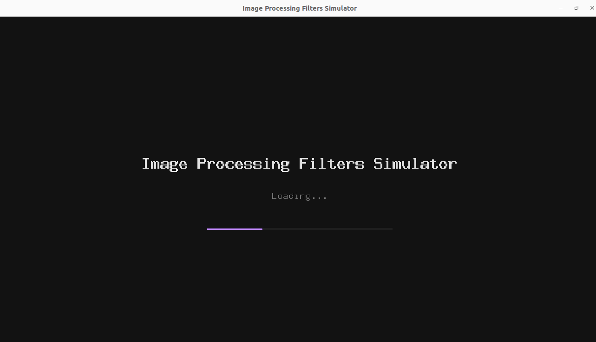
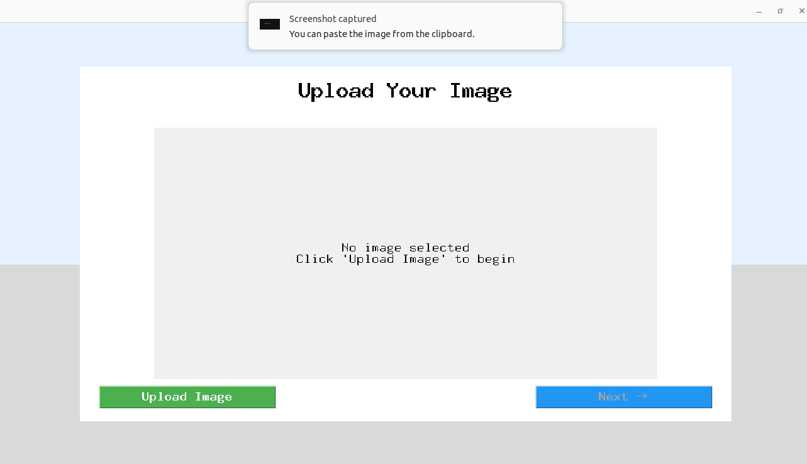
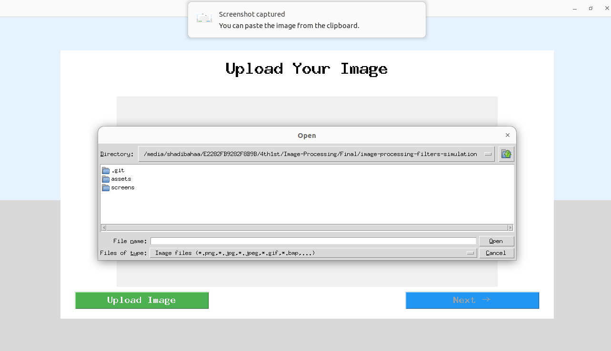
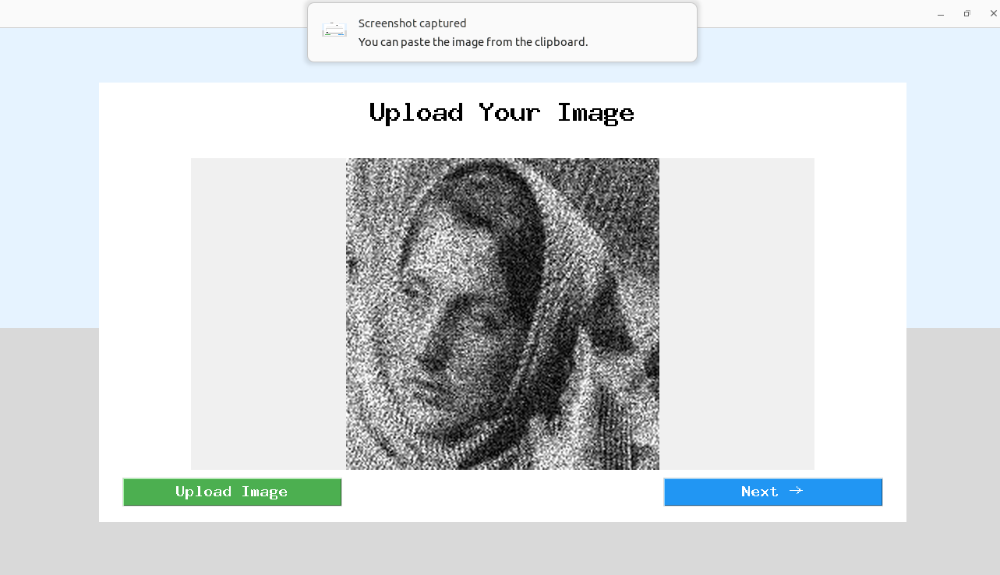
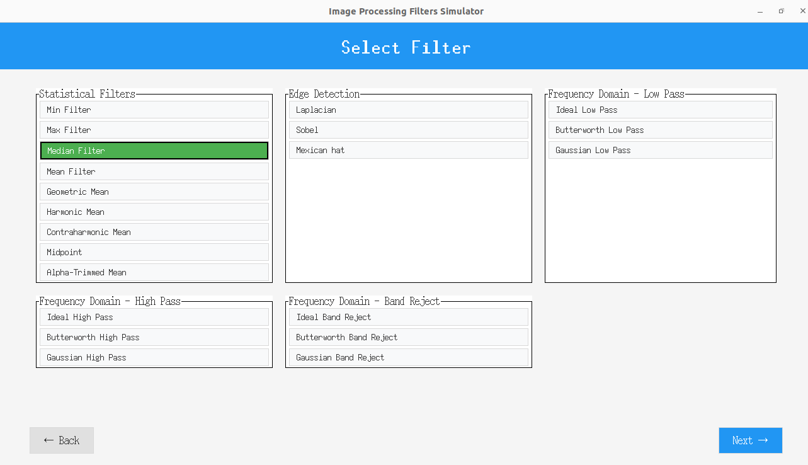
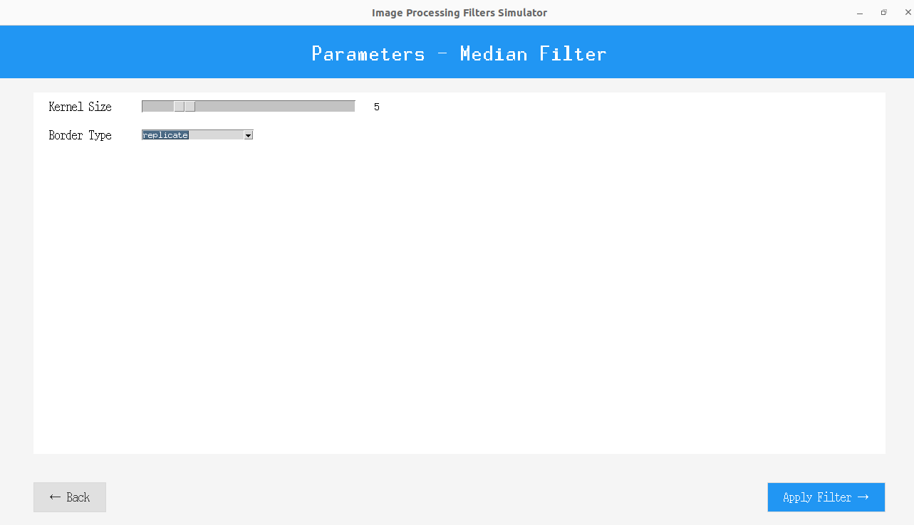
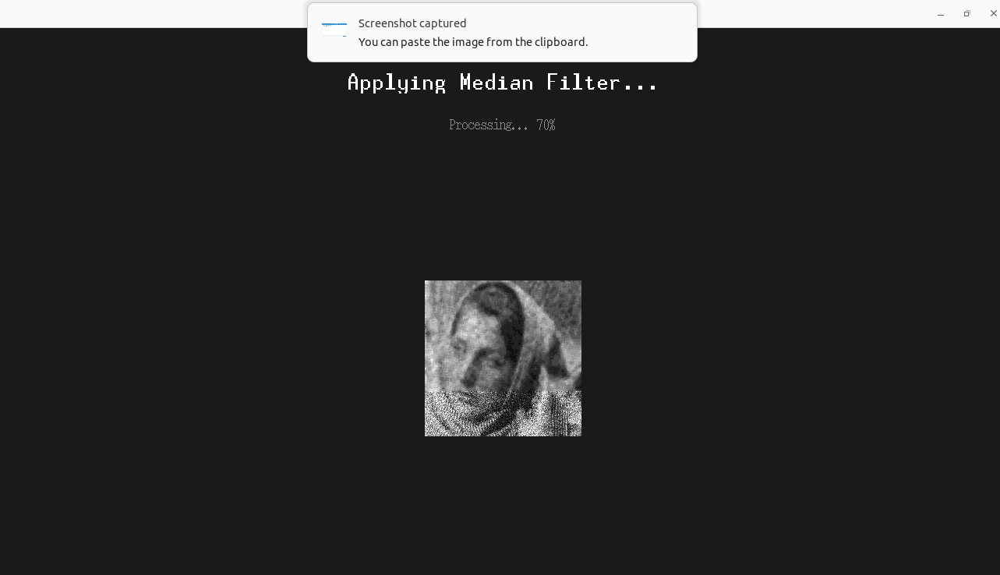
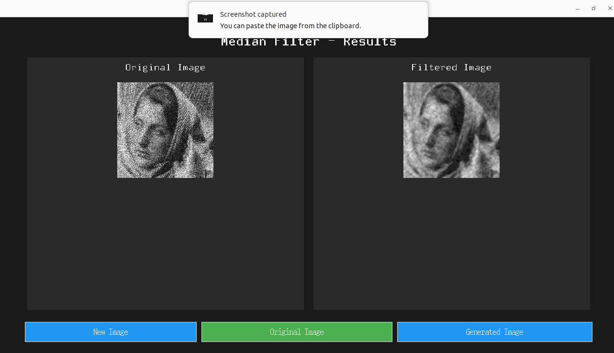

# image-processing-filters-simulation

## Introduction

This is a Python desktop application that provides an interactive GUI for applying a variety of image filters to photos. It is built with the Tkinter GUI toolkit and the OpenCV library. The application allows users to load an image, then apply filters one by one to observe their effects. It supports multiple categories of filters (spatial/statistical, edge-detection, and frequency-domain filters) and is useful for learning how different filters affect an image.

## Features

- **Image Input/Output:** Load images from your local file system for processing.
- **Statistical Filters:** Includes Min, Max, Median, Mean, Geometric Mean, Harmonic Mean, Contraharmonic Mean, Midpoint, and Alpha-Trimmed Mean filters.
- **Edge Detection Filters:** Includes Laplacian, Sobel, and Mexican Hat filters.
- **Frequency-Domain Filters:** Implements Low-Pass, High-Pass, and Band-Reject filters, each available in Ideal, Butterworth, and Gaussian variants.
- **Sequential Filtering:** Apply multiple filters in sequence. Each filter’s result can be fed into the next filter step-by-step, allowing complex effect combinations.
- **Interactive GUI:** A user-friendly Tkinter interface lets users select and apply filters with adjustable parameters (such as kernel size or cutoff frequency) and view the filtered image in real time.

## Project Structure
```
image-processing-filters-simulation/
├── assets/                # static image assets (e.g., icons, default images):contentReference[oaicite:0]{index=0}
│   ├── 26xBwQSdpeHVRLrgY.webp
│   ├── background.gif
│   ├── background.webp
│   ├── logo.png
│   └── noisy.png
├── screens/               # Python modules for GUI screens
│   ├── comparison_screen.py        # Screen class for side-by-side image comparison
│   ├── filter_selection_screen.py  # Screen to select different filters
│   ├── parameter_screen.py         # Screen to set filter parameters
│   ├── processing_screen.py        # Screen showing filtering process/results
│   ├── splash_screen.py            # Initial splash screen on launch
│   └── upload_screen.py            # Screen to upload/select an image
├── README.md            # Project documentation (this file):contentReference[oaicite:1]{index=1}
└── main.py             # Main application script (GUI entry point):contentReference[oaicite:2]{index=2}

```


## Technologies Used

- **Python 3** — Core programming language.
- **Tkinter** — GUI toolkit for building the desktop interface.
- **OpenCV** — Image processing library.
- **NumPy** — Numerical computing library used by OpenCV.

## Installation and running

1. **Clone the repository:**
   ```bash
   git clone https://github.com/ShadiBahaa/image-processing-filters-simulation.git
   ```
2. **Install dependencies:**
    Ensure you have Python 3 installed. Then install the required Python libraries, for example: 
   ```bash
   pip install opencv-python numpy
   ```
   (Tkinter usually comes with Python. If Tkinter is not installed, install it via your system’s package manager, e.g., ```sudo apt-get install python3-tk``` on Debian/Ubuntu.)

3. **Run the application:**
   inside the folder, run the following command:
   ```bash
   python main.py
   ```

## Screenshots

### Splash Screen


### Uploading image Screen: Initial


### Uploading image Screen: Opening file systems


### Uploading image Screen: Choosing image


### Filters Screen


### Parameters Screen


### Filtering Screen: progress bar shown


### Filtering results Screen

